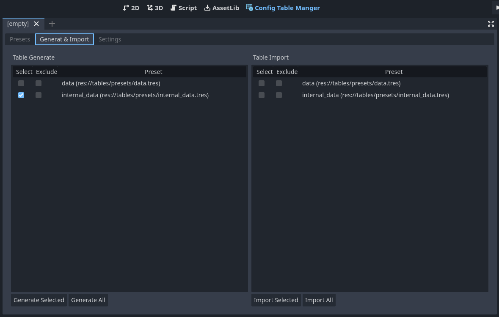
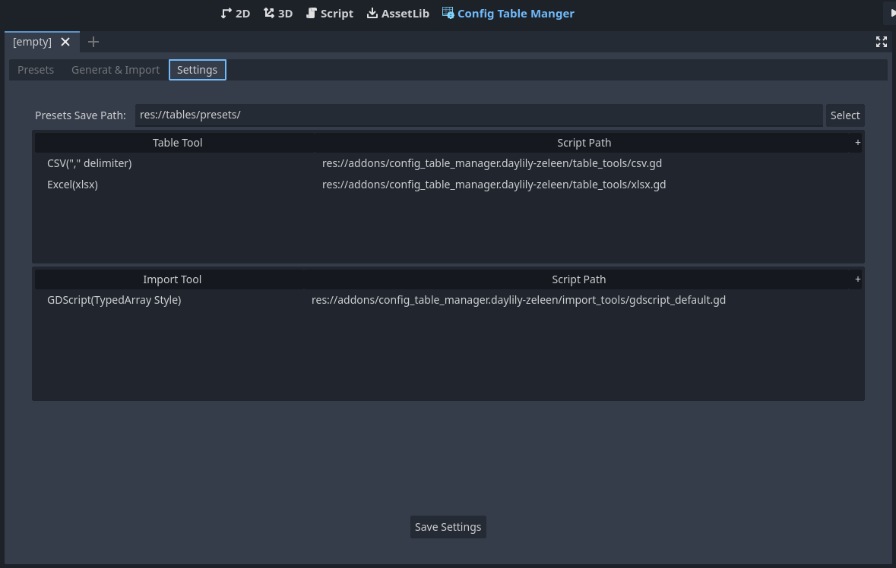

# Config Table Manager

[点击这里查看中文说明](README.zh.md)

A Godot plugin for managing config/data tables.

## Features

1. Easy to use, generate table header by using a data class. Allow to add additional columns.
2. How to generate and import can be save as a preset, convenient to adjust repeatedly.
3. Support backup and merge when regenerating tables.
4. Highly customizable, you can add your **Table Tool** and **Import Tool** to generate table file and import as resource which are meet your needs. ( This plugin is provide **CSV**, **xlsx** table tools, and provide **GDScript(TypedArray/Dictionary)** import tool.)
5. You can add Generate Modifier and Import Modifier to insert your logic for modify data in generating and importing workflow.

## Concepts

1. Preset：
    A resource to descript how to generate table file and how to import as resource.
2. Table Tool:
    A tool script to parse and generate table file, must extend from `res://addons/config_table_manager.daylily-zeleen/table_tools/table_tool.gd`.
3. Import Tool:
    A tool script to import table data as a Godot resource, must extend from `res://addons/config_table_manager.daylily-zeleen/import_tools/import_tool.gd`.
4. Generate Modifier:
    A tool script to insert your custom logic to modify data in table generating workflow. It is useful for programmed data generating. Must extend from `res://addons/config_table_manager.daylily-zeleen/scripts/generate_modifier.gd`.
5. Import Modifier:
    A tool script to insert your custom logic to modify data in table import workflow. It is useful for programmed data generating and data validation. Must extend from `res://addons/config_table_manager.daylily-zeleen/scripts/import_modifier.gd`.

## How to Start

1. Get (clone, download, or from Asset Library) and install this plugin, and enabled it in editor, click " Config Table Manager" to show the main UI panel of this plugin.
2. Create your data class script.
3. Create your preset for the data class in "Presets" tab and fill required options:
   1. Select your data class script to fill `Data Class Script`.
   2. Fill `Table Name`。
   3. Fill `Preset Name`，and click "**Save**"。

   You don't need to changed other advance options.
   
4. Jump to "Generate & Import" tab check presets which you want to generate in left side (or generate all). Generated table files are located in `res://tables/` by default (default will generate csv table file, **Excel(xlsx) is supported**).
   
5. Modify the generated table file (.csv by default) in external editor (recommend to use "VScode" with "Edit csv" plugin for csv file). **Note: use utf8 for encoding.**
6. Return to the editor and select "Generate & Import" tab, check presets which you want to import as resource in right side (or import all). Imported resources are located in `res://tables/imported/` by default (default will generate as GDScript (TypedArray style)).
7. Now, you can use the imported resource in Godot. Typically, for default import as GDScript, you can instantiate the script to get data, please refer to the generated script for more details.

If you have any doubts, please clone or download this project in [Github page](https://github.com/Daylily-Zeleen/ConfigTableManager) to refer example presets first.

## Internal Tools

### 1. Table Tools

|Table Tool|Description|Options|Options Description|
|-|-|-|-|
|CSV("," delimiter)|Parse and generate ".csv" table file which use "," as delimiter.|arr_dict_with_brackets|arr_dict_with_brackets：Optional. If specified，add square/curly braces to array and dictionary type values during generation.|
|Excel(xlsx)|Parse and generate ".xlsx" file. Only overwrite specific worksheet.|sheet=your_sheet_name；parse_sheet_must_exists；arr_dict_with_brackets；colorize_header=true|sheet:**Required**. Specify the preset should operate which worksheet; parse_sheet_must_exists: Optional. If specified, if there have not the target worksheet during parsing, it will happen parse error. default is false; arr_dict_with_brackets：Optional. If specified, add square/curly braces to array and dictionary type values during generation; colorize_header：Optional. if `true`, colorize table header when generating. default is `true`.|

### 2. Import Tools

|Import Tool|Description|Options|Options Description|
|-|-|-|-|
|GDScript(TypedArray Style)|Import table as GDScript, hold an Array of data objects. It is work fine with the situation of having not many data.|generate_class_name|generate_class_name: Optional. If specified, and the `Table Name` is a valid identifier, use the `Table Name` to generate the global class name for the generated script (through `class_name` keyword).|
|GDScript(Dictionary Style)|Import table as GDScript, hold a Dictionary of data objects. Better search performance when dealing with larger quantities.|key=prop_name; generate_class_name|key: **Required**. To specify the property to be the Dictionary key. The the value of key property should not empty or duplicate;generate_class_name: Optional. If specified, and the `Table Name` is a valid identifier, use the `Table Name` to generate the global class name for the generated script (through `class_name` keyword).|

## Custom Tools

### Customize Table Tools and Import Tools

   

1. Extend `res://addons/config_table_manager.daylily-zeleen/table_tools/table_tool.gd` and override its virtual methods (starts with "_") to implement your table tool, to parse and generate table files which meet your needs. Then add the script to "Settings" tab and save settings, it will appear in the "Presets" tab.
2. Extend `res://addons/config_table_manager.daylily-zeleen/import_tools/import_tool.gd` and override its virtual methods (starts with "_") to implement your import tool, to import as resources which meet your needs. Then add the script to "Settings" tab and save settings, it will appear in the "Presets" tab.

### Customize Generate Modifiers and Import Modifiers

1. Extend `res://addons/config_table_manager.daylily-zeleen/scripts/generate_modifier.gd` and override its virtual methods (starts with "_").
2. Extend `res://addons/config_table_manager.daylily-zeleen/scripts/import_modifier.gd` and override its virtual methods (starts with "_").

Modifier is work with specific preset. To apply your modifier, you should select your modifier script for "Table Generate Modifier"/"Import Modifier" in `Generate Options`/`Import Options` tab of `Preset` tab. Remember to save preset.

## Welcome to submit your Table Tools and Import Tools

Welcome to submit your Table Tools and Import Tools (place in `res://addons/config_table_manager.daylily-zeleen/table_tools/`and `res://addons/config_table_manager.daylily-zeleen/import_tools/`), enrich the diversity of this plugin.

And welcome to submit any fix and improve.

## If this plugin can help your, please click a Star and consider to [buy me a coffee.](https://afdian.net/a/Daylily-Zeleen)

## TODO

1. Add C# import tool (I have not need for this, waiting for someone to submit or waiting for me if I have time).
